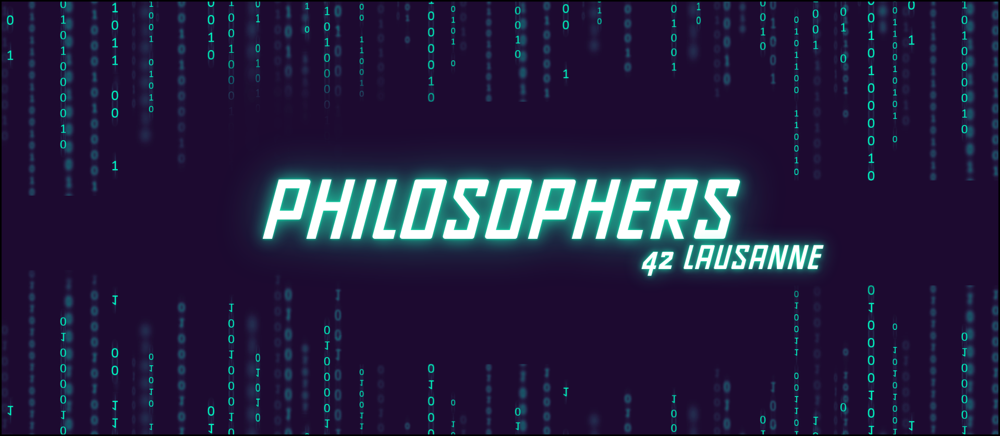

# Philosophers
The 42 Philosophers project involves managing synchronization and avoiding deadlocks among multiple threads representing philosophers eating and thinking, illustrating the challenges of concurrent programming.

[![Contributors][contributors-shield]][contributors-url]
[![Forks][forks-shield]][forks-url]
[![Stargazers][stars-shield]][stars-url]
[![Issues][issues-shield]][issues-url]
[![LinkedIn][linkedin-shield]][linkedin-url]

## 📒 Index

- [About](#about)
<!--- [Approach](#approach)-->
- [Installation](#installation)
- [Development](#development)
  <!-- [Pre-Requisites](#pre-requisites)-->
  - [File Structure](#file-structure)
 <!-- - [Diagram Architecture](#diagram-architecture)  -->
- [Notes](#notes)
- [Credits](#credits)

## About

**The Dining Philosophers problem is a classic in computer science used to illustrate the challenges of synchronization and managing shared resources in concurrent programming. Here’s a more detailed summary:**<br>

**Problem Description:**<br>

*Imagine a round table with five philosophers seated around it, each with a fork between each pair of neighbors. Each philosopher alternates between eating and thinking. To eat, a philosopher must use two forks: one to their left and one to their right.*<br>

<p align="center">
    
</p>

**The main challenges of this problem are:**<br>

* **Synchronization:** *Ensuring that philosophers can acquire the necessary forks without conflict. If each philosopher picks up the fork to their left first, then the fork to their right, deadlock can occur, where each philosopher is waiting for the fork held by another, leading to a situation where none can eat.*<br>

* **Deadlock Prevention:** *Developing mechanisms to prevent philosophers from ending up in a deadlock situation where all are indefinitely waiting to acquire the necessary resources.*<br>

* **Resource Management:** *Managing the forks fairly to avoid situations where some philosophers get to eat more frequently than others.*<br>

The problem is often used to teach principles of resource management in concurrency, thread synchronization, and deadlock prevention in computer systems.<br>

## Installation
```bash
# Clone this repository
$ git clone https://github.com/HaruSnak/Philosophers.git

# Go into the repository
$ cd Philosophers

# To compile the program
$ make

# Execution example
$ ./philo

# Execution example
$ ./philo number_of_philosophers time_to_die time_to_eat time_to_sleep [number_of_times_each_philosopher_must_eat]
$ ./philo 5 800 200 200

# Removes all generated files and the executable for a thorough cleanup.
$ make fclean

# Removes generated object files and the executable.
$ make clean
```

## Development
<!--### Pre-Requisites
```
```-->

### File Structure

```
.
└── 📁philosophers
    └── Makefile
    └── README.md
    └── 📁includes
        └── philo.h
    └── 📁srcs
        └── 📁body
            └── conditions.c
            └── routine.c
        └── 📁errors
            └── errors.c
            └── verification.c
        └── philo.c
        └── 📁tools
            └── utils.c
```

<!--### Diagram Architecture
Write the build Instruction here.-->

## Notes
Soon

## Credits

Below you will find the links used for this project:

- [Norm 42](https://cdn.intra.42.fr/pdf/pdf/960/norme.en.pdf)
- [Dining philosophers problem](https://en.wikipedia.org/wiki/Dining_philosophers_problem)
- [Threads, Mutexes and Concurrent Programming in C](https://www.codequoi.com/en/threads-mutexes-and-concurrent-programming-in-c/)

[contributors-shield]: https://img.shields.io/github/contributors/HaruSnak/Philosophers.svg?style=for-the-badge
[contributors-url]: https://github.com/HaruSnak/Philosophers/graphs/contributors
[forks-shield]: https://img.shields.io/github/forks/HaruSnak/Philosophers.svg?style=for-the-badge
[forks-url]: https://github.com/HaruSnak/Philosophers/network/members
[stars-shield]: https://img.shields.io/github/stars/HaruSnak/Philosophers.svg?style=for-the-badge
[stars-url]: https://github.com/HaruSnak/Philosophers/stargazers
[issues-shield]: https://img.shields.io/github/issues/HaruSnak/Philosophers.svg?style=for-the-badge
[issues-url]: https://github.com/HaruSnak/Philosophers/issues
[linkedin-shield]: https://img.shields.io/badge/-LinkedIn-black.svg?style=for-the-badge&logo=linkedin&colorB=555
[linkedin-url]: https://www.linkedin.com/in/shany-moreno-5a863b2aa
