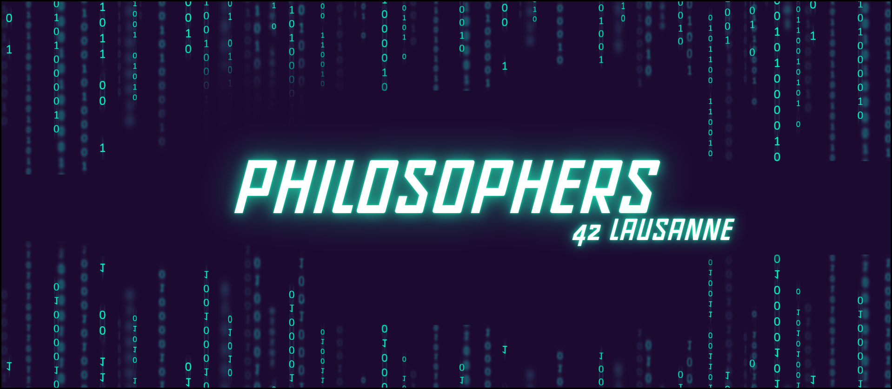

<div align="center">

# Philosophers
### A Concurrency Project at 42 School Using Threads and Mutexes

[![Contributors][contributors-shield]][contributors-url]
[![Forks][forks-shield]][forks-url]
[![Stargazers][stars-shield]][stars-url]
[![Issues][issues-shield]][issues-url]
[![License][license-shield]][license-url]

</div>

---

## 🇬🇧 English

<details>
<summary><b>📖 Click to expand/collapse English version</b></summary>

### 📖 About

**Philosophers** is a compulsory project for 42 School students. It consists of solving the classic Dining Philosophers problem using threads and mutexes in C. Philosophers must eat, think, and sleep without causing deadlocks or data races, while managing shared resources (forks).

This project teaches:
- Concurrent programming with POSIX threads (pthreads)
- Synchronization using mutexes to prevent race conditions
- Deadlock prevention and resource management
- Time management with gettimeofday and usleep
- Error handling and argument validation
- Memory management in multi-threaded environments

### 🧠 Skills Learned

By completing the Philosophers project, students develop essential skills in C programming and concurrency:

- **Thread management**: Creating, joining, and detaching threads with pthreads.
- **Mutex usage**: Protecting shared resources with mutexes to avoid data races.
- **Synchronization**: Implementing eating, thinking, and sleeping cycles with proper locking.
- **Deadlock avoidance**: Strategies to prevent circular waits (e.g., odd/even philosopher handling).
- **Time handling**: Using gettimeofday for timestamps and usleep for delays.
- **Argument parsing**: Validating command-line arguments for simulation parameters.
- **Logging**: Thread-safe printing of philosopher states with timestamps.
- **Monitoring**: Implementing a monitor thread to detect deaths and meal completion.
- **Code organization**: Modular code structure adhering to 42 norms.

## Approach
The implementation focuses on a clean, thread-safe solution to the Dining Philosophers problem. Each philosopher is a separate thread, with forks represented as mutexes. A monitor thread checks for deaths and meal completion. Odd-numbered philosophers pick up the left fork first, even-numbered the right, to reduce deadlock risk. Logging is protected by a write mutex to ensure no overlapping messages.

### **Features**

**Thread-based simulation:** *Each philosopher runs in its own thread, alternating between eating, sleeping, and thinking.*<br>

**Mutex-protected forks:** *Forks are shared resources locked with mutexes to prevent simultaneous access.*<br>

**Death detection:** *Monitor thread checks if a philosopher hasn't eaten within time_to_die milliseconds.*<br>

**Meal counting:** *Optional parameter to stop simulation after all philosophers have eaten a specified number of times.*<br>

**Thread-safe logging:** *All state changes are printed with timestamps, protected by a mutex.*<br>

### **Key Mechanics**

- **Eating:** Philosopher locks two adjacent forks, eats for time_to_eat ms, then unlocks.
- **Sleeping:** After eating, sleeps for time_to_sleep ms.
- **Thinking:** Philosopher thinks until ready to eat again.
- **Death:** If time since last meal > time_to_die and not eating, philosopher dies.
- **Simulation end:** Stops on death or when all have eaten enough (if specified).

### 📋 Table of Contents

- [Features](#features)
- [Installation](#installation)
- [Usage](#usage)
- [Project Structure](#project-structure)
- [Compilation](#compilation)
- [Function Reference](#function-reference)
- [Credits](#credits)

<a name="features"></a>

### ✨ Features

- **Multi-threaded simulation** of the Dining Philosophers problem
- **Mutex synchronization** for fork access and logging
- **Death monitoring** with precise timing
- **Optional meal limits** for simulation termination
- **Thread-safe output** with millisecond timestamps
- **Argument validation** and error handling
- **42 School norm compliance**

<a name="installation"></a>

### 🚀 Installation

```bash
# Clone the repository
git clone https://github.com/HaruSnak/42-philosophers
cd 42-philosophers
```

<a name="usage"></a>

### 💻 Usage

Compile and run the program with arguments:

```bash
make
./philo number_of_philosophers time_to_die time_to_eat time_to_sleep [number_of_times_each_philosopher_must_eat]
```

Example:
```bash
./philo 5 800 200 200 7
```

Arguments:
- **number_of_philosophers**: Number of philosophers (1-200)
- **time_to_die**: Time in ms before death if not eating
- **time_to_eat**: Eating duration in ms
- **time_to_sleep**: Sleeping duration in ms
- **[number_of_times_each_philosopher_must_eat]**: Optional, stops when all have eaten this many times

<a name="project-structure"></a>

### 📂 Project Structure

```
42-philosophers/
├── Makefile                    # Build script
├── philo.h                     # Main header file
├── philo.c                     # Main entry point
├── LICENSE                     # License file
├── README.md                   # This file
├── README-Template.md          # Template for README
├── includes/
│   └── philo.h                 # Header with structs and prototypes
├── readme/                     # README assets
└── srcs/                       # Source files
    ├── philo.c                 # Main function and initialization
    ├── body/
    │   ├── conditions.c        # Monitor and loop conditions
    │   └── routine.c           # Philosopher routine
    ├── errors/
    │   ├── errors.c            # Error handling and cleanup
    │   └── verification.c      # Argument validation
    └── tools/
        └── utils.c             # Utilities (atoi, time, print, usleep)
```

<a name="compilation"></a>

### 🔧 Compilation

Compile the project using the Makefile:

```bash
make          # Compile the program
make clean    # Remove object files
make fclean   # Remove executable and object files
make re       # Recompile everything
```

<a name="function-reference"></a>

### 📚 Function Reference

#### Main Functions
- [`main`](srcs/philo.c) - Program entry, argument parsing, thread creation
- [`ft_routine`](srcs/body/routine.c) - Philosopher's eat/sleep/think loop
- [`ft_monitor`](srcs/body/conditions.c) - Monitor thread for deaths and meals
- [`ft_print`](srcs/tools/utils.c) - Thread-safe logging with timestamps

#### Key Features
- **Mutex Locking**: Protects forks and shared data
- **Time Management**: Uses gettimeofday for precise timing
- **Death Check**: Compares last meal time with time_to_die
- **Loop Control**: Checks dead flag to stop simulation

### 👨‍🎓 Note
<p align="left">
    
</p>

<a name="credits"></a>

### 📖 Credits

- **42 School Norm**: [Official C Coding Standard](https://cdn.intra.42.fr/pdf/pdf/960/norme.en.pdf)
- **Dining Philosophers Problem**: [Wikipedia](https://en.wikipedia.org/wiki/Dining_philosophers_problem)
- **POSIX Threads**: [IEEE Std 1003.1](https://pubs.opengroup.org/onlinepubs/9699919799/)

### 📄 License

This project is licensed under the **MIT License** - see the [LICENSE](LICENSE) file for details.

</details>

---

## 🇫🇷 Français

<details>
<summary><b>📖 Cliquez pour développer/réduire la version française</b></summary>

### 📖 À propos

**Philosophers** est un projet obligatoire pour les étudiants de l'école 42. Il s'agit de résoudre le problème classique des Philosophes mangeant en utilisant des threads et des mutex en C. Les philosophes doivent manger, penser et dormir sans causer d'interblocages ou de courses de données, tout en gérant des ressources partagées (fourchettes).

Ce projet enseigne :
- La programmation concurrente avec les threads POSIX (pthreads)
- La synchronisation utilisant des mutex pour éviter les conditions de course
- La prévention des interblocages et la gestion des ressources
- La gestion du temps avec gettimeofday et usleep
- La gestion d'erreurs et la validation des arguments
- La gestion de la mémoire dans des environnements multi-threads

### 🧠 Compétences acquises

En complétant le projet Philosophers, les étudiants développent des compétences essentielles en programmation C et concurrence :

- **Gestion des threads** : Créer, joindre et détacher des threads avec pthreads.
- **Utilisation des mutex** : Protéger les ressources partagées avec des mutex pour éviter les courses de données.
- **Synchronisation** : Implémenter des cycles manger/penser/dormir avec un verrouillage approprié.
- **Évitement des interblocages** : Stratégies pour prévenir les attentes circulaires (ex. : gestion philosophe impair/pair).
- **Gestion du temps** : Utiliser gettimeofday pour les horodatages et usleep pour les délais.
- **Analyse des arguments** : Valider les arguments de ligne de commande pour les paramètres de simulation.
- **Journalisation** : Impression thread-safe des états des philosophes avec horodatages.
- **Surveillance** : Implémenter un thread moniteur pour détecter les décès et l'achèvement des repas.
- **Organisation du code** : Structure modulaire du code respectant les normes 42.

## Approche
L'implémentation se concentre sur une solution propre et thread-safe au problème des Philosophes mangeant. Chaque philosophe est un thread séparé, avec des fourchettes représentées comme des mutex. Un thread moniteur vérifie les décès et l'achèvement des repas. Les philosophes impairs prennent d'abord la fourchette gauche, pairs la droite, pour réduire le risque d'interblocage. La journalisation est protégée par un mutex d'écriture pour assurer l'absence de messages chevauchés.

### **Fonctionnalités**

**Simulation basée sur les threads :** *Chaque philosophe fonctionne dans son propre thread, alternant entre manger, dormir et penser.*<br>

**Fourchettes protégées par mutex :** *Les fourchettes sont des ressources partagées verrouillées avec des mutex pour empêcher l'accès simultané.*<br>

**Détection de décès :** *Le thread moniteur vérifie si un philosophe n'a pas mangé dans les time_to_die millisecondes.*<br>

**Comptage des repas :** *Paramètre optionnel pour arrêter la simulation après que tous les philosophes aient mangé un nombre spécifié de fois.*<br>

**Journalisation thread-safe :** *Tous les changements d'état sont imprimés avec des horodatages, protégés par un mutex.*<br>

### **Mécaniques clés**

- **Manger :** Le philosophe verrouille deux fourchettes adjacentes, mange pendant time_to_eat ms, puis déverrouille.
- **Dormir :** Après manger, dort pendant time_to_sleep ms.
- **Penser :** Le philosophe pense jusqu'à être prêt à manger à nouveau.
- **Décès :** Si le temps depuis le dernier repas > time_to_die et pas en train de manger, le philosophe meurt.
- **Fin de simulation :** S'arrête sur décès ou quand tous ont assez mangé (si spécifié).

### 📋 Table des matières

- [Fonctionnalités](#fonctionnalités)
- [Installation](#installation-1)
- [Utilisation](#utilisation)
- [Structure du projet](#structure-du-projet)
- [Compilation](#compilation-1)
- [Référence des fonctions](#référence-des-fonctions)
- [Crédits](#crédits-1)

<a name="fonctionnalités"></a>

### ✨ Fonctionnalités

- **Simulation multi-thread** du problème des Philosophes mangeant
- **Synchronisation par mutex** pour l'accès aux fourchettes et la journalisation
- **Surveillance des décès** avec timing précis
- **Limites de repas optionnelles** pour la terminaison de la simulation
- **Sortie thread-safe** avec horodatages en millisecondes
- **Validation des arguments** et gestion d'erreurs
- **Conformité aux normes 42**

<a name="installation-1"></a>

### 🚀 Installation

```bash
# Cloner le dépôt
git clone https://github.com/HaruSnak/42-philosophers
cd 42-philosophers
```

<a name="utilisation"></a>

### 💻 Utilisation

Compilez et lancez le programme avec des arguments :

```bash
make
./philo number_of_philosophers time_to_die time_to_eat time_to_sleep [number_of_times_each_philosopher_must_eat]
```

Exemple :
```bash
./philo 5 800 200 200 7
```

Arguments :
- **number_of_philosophers** : Nombre de philosophes (1-200)
- **time_to_die** : Temps en ms avant décès si pas en train de manger
- **time_to_eat** : Durée de manger en ms
- **time_to_sleep** : Durée de dormir en ms
- **[number_of_times_each_philosopher_must_eat]** : Optionnel, arrête quand tous ont mangé ce nombre de fois

<a name="structure-du-projet"></a>

### 📂 Structure du projet

```
42-philosophers/
├── Makefile                    # Script de build
├── philo.h                     # Fichier d'en-tête principal
├── philo.c                     # Point d'entrée principal
├── LICENSE                     # Fichier de licence
├── README.md                   # Ce fichier
├── README-Template.md          # Template pour README
├── includes/
│   └── philo.h                 # En-tête avec structs et prototypes
├── readme/                     # Ressources README
└── srcs/                       # Fichiers sources
    ├── philo.c                 # Fonction main et initialisation
    ├── body/
    │   ├── conditions.c        # Moniteur et conditions de boucle
    │   └── routine.c           # Routine du philosophe
    ├── errors/
    │   ├── errors.c            # Gestion d'erreurs et nettoyage
    │   └── verification.c      # Validation des arguments
    └── tools/
        └── utils.c             # Utilitaires (atoi, time, print, usleep)
```

<a name="compilation-1"></a>

### 🔧 Compilation

Compilez le projet en utilisant le Makefile :

```bash
make          # Compiler le programme
make clean    # Supprimer les fichiers objets
make fclean   # Supprimer l'exécutable et les fichiers objets
make re       # Recompiler tout
```

<a name="référence-des-fonctions"></a>

### 📚 Référence des fonctions

#### Fonctions principales
- [`main`](srcs/philo.c) - Entrée du programme, analyse des arguments, création de threads
- [`ft_routine`](srcs/body/routine.c) - Boucle manger/dormir/penser du philosophe
- [`ft_monitor`](srcs/body/conditions.c) - Thread moniteur pour décès et repas
- [`ft_print`](srcs/tools/utils.c) - Journalisation thread-safe avec horodatages

#### Fonctionnalités clés
- **Verrouillage mutex** : Protège les fourchettes et données partagées
- **Gestion du temps** : Utilise gettimeofday pour un timing précis
- **Vérification de décès** : Compare le temps du dernier repas avec time_to_die
- **Contrôle de boucle** : Vérifie le drapeau mort pour arrêter la simulation

### 👨‍🎓 Note
<p align="left">
    
</p>

<a name="crédits-1"></a>

### 📖 Crédits

- **Norme 42** : [Standard C officiel](https://cdn.intra.42.fr/pdf/pdf/960/norme.en.pdf)
- **Problème des Philosophes mangeant** : [Wikipédia](https://fr.wikipedia.org/wiki/Probl%C3%A8me_des_philosophes)
- **Threads POSIX** : [IEEE Std 1003.1](https://pubs.opengroup.org/onlinepubs/9699919799/)

### 📄 Licence

Ce projet est sous licence **MIT** - voir le fichier [LICENSE](LICENSE) pour plus de détails.

</details>

---

[contributors-shield]: https://img.shields.io/github/contributors/HaruSnak/42-philosophers.svg?style=for-the-badge
[contributors-url]: https://github.com/HaruSnak/42-philosophers/graphs/contributors
[forks-shield]: https://img.shields.io/github/forks/HaruSnak/42-philosophers.svg?style=for-the-badge
[forks-url]: https://github.com/HaruSnak/42-philosophers/network/members
[stars-shield]: https://img.shields.io/github/stars/HaruSnak/42-philosophers.svg?style=for-the-badge
[stars-url]: https://github.com/HaruSnak/42-philosophers/stargazers
[issues-shield]: https://img.shields.io/github/issues/HaruSnak/42-philosophers.svg?style=for-the-badge
[issues-url]: https://github.com/HaruSnak/42-philosophers/issues
[linkedin-shield]: https://img.shields.io/badge/-LinkedIn-black.svg?style=for-the-badge&logo=linkedin&colorB=555
[linkedin-url]: https://www.linkedin.com/in/shany-moreno-5a863b2aa
[license-shield]: https://img.shields.io/github/license/HaruSnak/42-philosophers.svg?style=for-the-badge
[license-url]: https://github.com/HaruSnak/42-philosophers/blob/master/LICENSE
